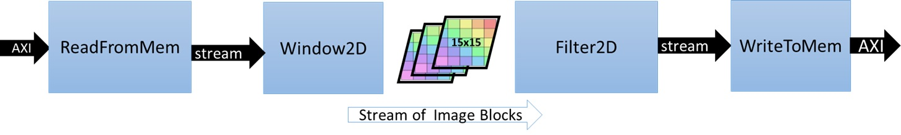
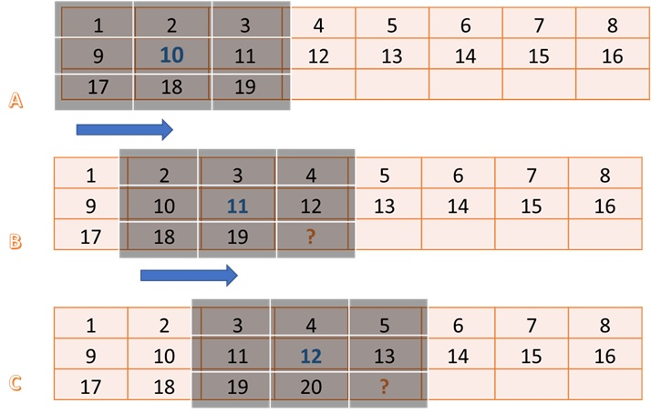

## Introduction


以下介绍 hardware 部分 hls 代码，详细代码参考 `./src/filter2d_hw.cpp`，顶层模块叫做 `Filter2DKernel`，具体代码如下：

```c++
void Filter2DKernel(
        const char           coeffs[256],
        float                factor,
        short                bias,
        unsigned short       width,
        unsigned short       height,
        unsigned short       stride,
        const unsigned char  src[MAX_IMAGE_WIDTH*MAX_IMAGE_HEIGHT],
        unsigned char        dst[MAX_IMAGE_WIDTH*MAX_IMAGE_HEIGHT])
{
            
#pragma HLS DATAFLOW

  // Stream of pixels from kernel input to filter, and from filter to output
  hls::stream<char,2>    coefs_stream;
  hls::stream<U8,2>      pixel_stream;
  hls::stream<window,3>  window_stream; // Set FIFO depth to 0 to minimize resources
  hls::stream<U8,64>     output_stream;

  // Read image data from global memory over AXI4 MM, and stream pixels out
  ReadFromMem(width, height, stride, coeffs, coefs_stream, src, pixel_stream);

  // Read incoming pixels and form valid HxV windows
  Window2D(width, height, pixel_stream, window_stream);

  // Process incoming stream of pixels, and stream pixels out
  Filter2D(width, height, factor, bias, coefs_stream, window_stream, output_stream);

  // Write incoming stream of pixels and write them to global memory over AXI4 MM
  WriteToMem(width, height, stride, output_stream, dst);

}
```

顶层模块下包含四个功能模块，它们以 dataflow 方式并行，可以参考如下示意图：



`ReadFromMem` 模块通过 `AXI4 MM` 协议从 global memory 中读取 coeff 矩阵以及像素矩阵，然后通过 `coefs_stream` 和 `pixel_stream` 分别将两矩阵中的元素传递给后续模块，其代码如下：

```c++
void ReadFromMem(
        unsigned short       width,
        unsigned short       height,
        unsigned short       stride,
        const char          *coeffs,
        hls::stream<char>   &coeff_stream,
        const unsigned char *src,
        hls::stream<U8>     &pixel_stream )
{
    assert(stride <= MAX_IMAGE_WIDTH);
    assert(height <= MAX_IMAGE_HEIGHT);
    assert(stride%64 == 0);

    unsigned num_coefs = FILTER_V_SIZE*FILTER_H_SIZE;
    unsigned num_coefs_padded = (((num_coefs-1)/64)+1)*64; // Make sure number of reads of multiple of 64, enables auto-widening
    read_coefs: for (int i=0; i<num_coefs_padded; i++) {
        U8 coef = coeffs[i];
        if (i<num_coefs) coeff_stream.write( coef );        
    }

    stride = (stride/64)*64; // Makes compiler see that stride is a multiple of 64, enables auto-widening
    unsigned offset = 0;
    unsigned x = 0;
    read_image: for (int n = 0; n < height*stride; n++) {
        U8 pix = src[n];
        if (x<width) pixel_stream.write( pix );
        if (x==(stride-1)) x=0; else x++;
     }
}
```

注意如下几点：
- 读取的次数要为64的倍数，即用于读取 global memory 的循环，其循环次数要为 64 的倍数
- `coeff_stream.write( coef )`, `pixel_stream.write( pix )`, 就是向 stream 中写入值，或者可以理解为入队操作

`Window2D` 模块逐个处理通过 `pixel_stream` 从 `ReadFromMem` 模块传来的每个像素，并逐个生成 window 传递给后续 `Filter2D` 模块，其中 window 的定义如下：

```c++
struct window {
    U8 pix[FILTER_V_SIZE][FILTER_H_SIZE];
};
```

`Window2D` 模块能做到每接收一个新的像素，就生成一个新的 window，靠的是 `LineBuffer`，其定义如下：

```c++
U8 LineBuffer[FILTER_V_SIZE-1][MAX_IMAGE_WIDTH];  
#pragma HLS ARRAY_PARTITION variable=LineBuffer dim=1 complete
```

下图 B 中 window 的后两列和 A 中 window 的前两列相同，最后一列的前两行可以通过读取 `LineBuffer` 得到，只有右下角的元素是所接收的新像素。这就是 window 的更新逻辑，具体代码表示如下：

```c++
  // Shift the window and add a column of new pixels from the line buffer
  for(int i = 0; i < FILTER_V_SIZE; i++) {
      for(int j = 0; j < FILTER_H_SIZE-1; j++) {
          Window.pix[i][j] = Window.pix[i][j+1];
      }
      Window.pix[i][FILTER_H_SIZE-1] = (i<FILTER_V_SIZE-1) ? LineBuffer[i][col_ptr] : new_pixel;
  }
```

每次循环都会更新 `LineBuffer` 的某列， 例如下图中 A 到 B，`LineBuffer` 的第三列由 3，11 更新为 11，19，其更新逻辑如下代码所示：

```c++
  // Shift pixels in the column of pixels in the line buffer, add the newest pixel
  for(int i = 0; i < FILTER_V_SIZE-2; i++) {
      LineBuffer[i][col_ptr] = LineBuffer[i+1][col_ptr];
  }
  LineBuffer[FILTER_V_SIZE-2][col_ptr] = new_pixel;
```



注意，需要读取一定数量像素后，才会生成第一个 window，例如对于 window size 为 3*3 的情况，需要读取完图片左上角 2\*2 的矩阵后，才能开始计算图片第一个像素卷积后的值，对于上图中的矩阵，需要读取到10，才生成第一个 window，需要提前读取的像素数量按如下方式计算：

```c++
unsigned ramp_up = width*((FILTER_V_SIZE-1)/2)+(FILTER_H_SIZE-1)/2;
```

`Window2D` 模块需要循环 $ramp\_up + num\_pixels$ 次，前 $ramp\_up$ 次提前读取像素，不生成 window，后 $num\_pixels$ 次每次生成一个 window 传递给 `Filter2D` 模块。

`Filter2D` 模块进行卷积运算，每接受一个 window，计算出一个像素的卷积值，然后将该值传递给 `WriteToMem` 模块。其计算流程与软件端区别不大：

```c++
// Process the incoming stream of pixel windows
    apply_filter: for (int y = 0; y < height; y++) 
    {
        for (int x = 0; x < width; x++) 
        {
#pragma HLS PIPELINE II=1
            // Read a 2D window of pixels
            window w = window_stream.read();

            // Apply filter to the 2D window
            int sum = 0;
            for(int row=0; row<FILTER_V_SIZE; row++) 
            {
                for(int col=0; col<FILTER_H_SIZE; col++) 
                {
                    unsigned char pixel;
                    int xoffset = (x+col-(FILTER_H_SIZE/2));
                    int yoffset = (y+row-(FILTER_V_SIZE/2));
                    // Deal with boundary conditions : clamp pixels to 0 when outside of image 
                    if ( (xoffset<0) || (xoffset>=width) || (yoffset<0) || (yoffset>=height) ) {
                        pixel = 0;
                    } else {
                        pixel = w.pix[row][col];
                    }
                    sum += pixel*(char)coeffs[row][col];
                }
            }

            // Normalize result
            unsigned char outpix = MIN(MAX((int(factor * sum)+bias), 0), 255);

            // Write the output pixel
            pixel_stream.write(outpix);
        }
    }
```

需要注意的是其中的 `coeffs` 是一个片上 `buffer`，存储了 `coeff` 矩阵的内容，避免了每次获取 `coeff` 元素值都需要访问 global memory。

`WriteToMem` 模块将像素逐个写回 global memory，其代码如下：

```c++
void WriteToMem(
        unsigned short       width,
        unsigned short       height,
        unsigned short       stride,
        hls::stream<U8>     &pixel_stream,
        unsigned char       *dst)
{
    assert(stride <= MAX_IMAGE_WIDTH);
    assert(height <= MAX_IMAGE_HEIGHT);
    assert(stride%64 == 0);

    stride = (stride/64)*64; // Makes compiler see that stride is a multiple of 64, enables auto-widening
    unsigned offset = 0;
    unsigned x = 0;
    write_image: for (int n = 0; n < height*stride; n++) {
        U8 pix = (x<width) ? pixel_stream.read() : 0;
        dst[n] = pix;
        if (x==(stride-1)) x=0; else x++;
    }    
}
```

