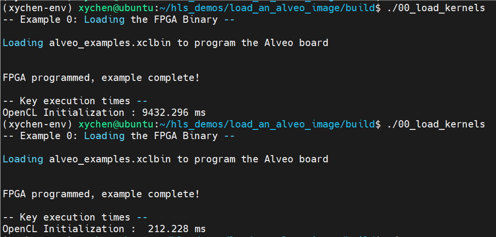

## Introduction

这个例子展示了如何将 xclbin 文件加载到 U280 板子上。通过这个例子，你可以熟悉 OpenCL 的简单用法。

`./src/xilinx_ocl_helper.cpp` 中的 `find_xilinx_devices()` 函数可以自动扫描发现通过 PCIE 连接的 U280 板卡，函数具体细节如下：
```c++
std::vector<cl::Device> XilinxOclHelper::find_xilinx_devices()
{
    size_t i;
    std::vector<cl::Platform> platforms;
    cl::Platform::get(&platforms);        // 获取所有 platform

    cl::Platform platform;
    for (i = 0; i < platforms.size(); i++) {
        platform                  = platforms[i];
        std::string platform_name = platform.getInfo<CL_PLATFORM_NAME>();
        if (platform_name == "Xilinx") {  // 获取名为 Xilinx 的 platform
            break;
        }
    }
    if (i == platforms.size()) {
        throw_lineexception("Unable to find Xilinx OpenCL devices");
    }

    // Get ACCELERATOR devices
    std::vector<cl::Device> devices;
    platform.getDevices(CL_DEVICE_TYPE_ACCELERATOR, &devices);
    return devices;
}
```

按如下命令进行编译：
```bash
mkdir build && cd build
cmake ..   -DXRT_LIBS=/opt/xilinx/xrt/lib/libxilinxopencl.so
make
```

将预先编译好的 xclbin 文件拷贝到 build 下，以便后续执行：
```bash
cp ../prebuild/alveo_examples.xclbin ./
```

在执行之前，你可以通过 `xbutil` 命令来查看板卡信息，首先运行 `xbutil examine` 获取 device id，例如下图所示的 `0000:61:00.1`：


然后运行 `xbutil examine --device 0000:61:00.1` 查看板卡具体信息：


执行 `./00_load_kernels` 可以看到如下输出：



可以看到，第二次加载所需时间明显小于第一次，因为第二次相较于第一次，少了许多初始化操作。

烧写后，运行 `xbutil examine --device 0000:61:00.1` 查看板卡具体信息：


可以看到相较于烧写前，板卡上的 PL 已加载 vadd，正是我们之前写入的 xclbin 文件。


