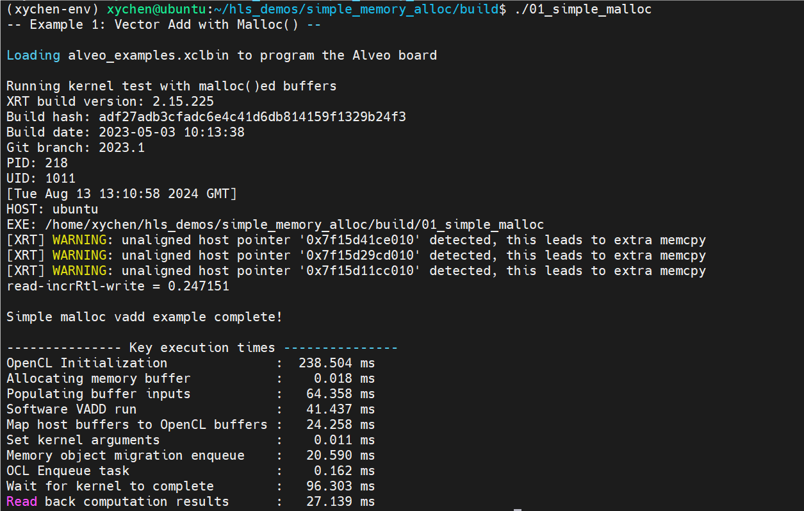

## Introduction
这个例子展示了如何使用 U280 板卡加速向量加法。通过这个例子，你可以学会如何将 vadd hardware kernel 加载到板卡，以及如何与其交互以获得正确的运算结果。


运行这个例子前，首先需要编译硬件部分代码。按如下命令编译 vadd hardware kernel，生成 xclbin 文件，以便后续 program 到 u280 板卡上。
```bash
cd hw_src
make
```
编译大概需要两个小时，编译成功后，你可以看到 `hw_src` 文件夹下出现了 `alveo_examples.xclbin` 文件。

其次需要编译软件部分代码。按如下命令进行编译：

```bash
mkdir build && cd build
cmake ..   -DXRT_LIBS=/opt/xilinx/xrt/lib/libxilinxopencl.so
make
```

然后将 `alveo_examples.xclbin` 拷贝到 build 文件夹下方便后续执行

```bash
cp ../hw_src/alveo_examples.xclbin ./
```

接下来讲解一下 host 端代码。

首先在 host 端分配四个 buffer，其中 a、b 存储输入向量，c 存储硬件端运算结果，d 存储软件端运算结果：

```c++
    uint32_t *a = new uint32_t[BUFSIZE];
    uint32_t *b = new uint32_t[BUFSIZE];
    uint32_t *c = new uint32_t[BUFSIZE];
    uint32_t *d = new uint32_t[BUFSIZE];
```

其次在 u280 global memory 上分配三个 buffer，用 OpenCL 对象 cl::Buffer 来表示，具体代码如下：

```c++
    cl::Buffer a_to_device(xocl.get_context(),
                           static_cast<cl_mem_flags>(CL_MEM_READ_ONLY |
                                                     CL_MEM_USE_HOST_PTR),
                           BUFSIZE * sizeof(uint32_t),
                           a,
                           NULL);
    cl::Buffer b_to_device(xocl.get_context(),
                           static_cast<cl_mem_flags>(CL_MEM_READ_ONLY |
                                                     CL_MEM_USE_HOST_PTR),
                           BUFSIZE * sizeof(uint32_t),
                           b,
                           NULL);
    cl::Buffer c_from_device(xocl.get_context(),
                             static_cast<cl_mem_flags>(CL_MEM_WRITE_ONLY |
                                                       CL_MEM_USE_HOST_PTR),
                             BUFSIZE * sizeof(uint32_t),
                             c,
                             NULL);
```
其中 CL_MEM_READ_ONLY 指的是从 kernel 角度来看 a_to_device 是 READ_ONLY，所以 a_to_device 是 vadd kernel 的输入。

为了让板卡上的 buffer 作为 kernel 的输入，我们需要指定 buffer 与 kernel 端口的对应关系，具体代码如下：

```c++
    krnl.setArg(0, a_to_device);
    krnl.setArg(1, b_to_device);
    krnl.setArg(2, c_from_device);
    krnl.setArg(3, BUFSIZE);
```

然后可以将 host 端 buffer 的数据传送到板卡上，具体代码如下：

```c++
    // Send the buffers down to the Alveo card
    et.add("Memory object migration enqueue");
    cl::Event event_sp;
    q.enqueueMigrateMemObjects({a_to_device, b_to_device}, 0, NULL, &event_sp);
    clWaitForEvents(1, (const cl_event *)&event_sp);
    et.add("OCL Enqueue task");
```

接下来就可以启动 kernel 进行运算了！

```c++
    q.enqueueTask(krnl, NULL, &event_sp);
    et.add("Wait for kernel to complete");
    clWaitForEvents(1, (const cl_event *)&event_sp);
```

最终从 device 端读取数据到 host 端，运算完成！

```c++
    // Migrate memory back from device
    et.add("Read back computation results");
    q.enqueueMigrateMemObjects({c_from_device}, CL_MIGRATE_MEM_OBJECT_HOST, NULL, &event_sp);
    clWaitForEvents(1, (const cl_event *)&event_sp);
    et.finish();
```

到 build 文件夹下运行 `./01_simple_malloc`，可以看到输出：



从图中可以看到 unaligned host pointer warning，这是因为我们传输到板卡或从板卡传输的所有 buffer 都没有满足 Alveo DMA 引擎所需的 4 KiB 边界对齐。因此，我们需要复制缓冲区内容，以便在传输之前对齐它们，而该操作开销很大。

接下来我们会修改 `BUFSIZE` 来进行一些 profile 实验，实验结果如下，其中时间单位为 ms：

| BUFSIZE                     | 24M     | 48M     | 96M     | 192M    | 384M     |
|-----------------------------|---------|---------|---------|---------|----------|
| OCL Initialization          | 189.077 | 213.304 | 249.840 | 279.545 | 330.445  |
| Buffer Allocation           | 0.020   | 0.019   | 0.016   | 0.018   | 0.019    |
| Buffer Population           | 67.433  | 135.391 | 267.871 | 531.486 | 1066.288 |
| Software VADD               | 42.348  | 84.687  | 168.109 | 341.356 | 681.165  |
| Buffer Mapping              | 27.820  | 54.956  | 106.038 | 205.436 | 378.098  |
| Write Buffers Out           | 20.555  | 30.049  | 46.584  | 170.465 | 213.417  |
| Set Kernel Args             | 0.009   | 0.013   | 0.016   | 0.016   | 0.017    |
| Kernel Runtime              | 96.204  | 191.980 | 383.688 | 767.041 | 1533.871 |
| Read Buffer In              | 26.626  | 44.940  | 72.024  | 132.101 | 252.292  |

从实验结果可以看出：

- `Buffer Allocation`，`Set Kernel Args` 与 BUFSIZE 几乎无关
- `Buffer Population`，`Software VADD`，`Buffer Mapping`，`Kernel Runtime`，`Read Buffer In` 随着 BUFSIZE 线性增加