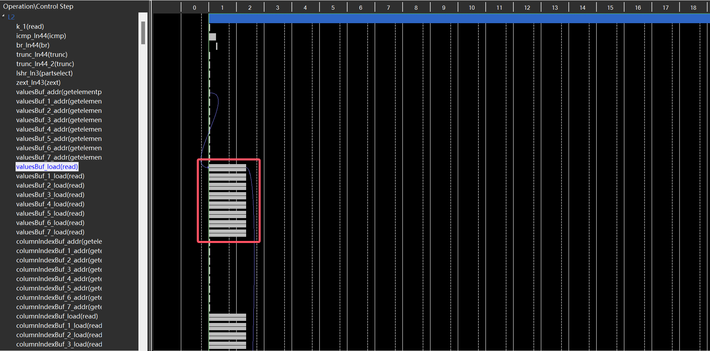

## Introduction

这个例子介绍下如何用 FPGA 对 SpMV 运算进行加速，并介绍一些简单的优化 trick。

### Baseline
最基础版本的 CSR 格式的 SpMV 代码如下：

```c++
void spmv(
  int rowPtr[NUM_ROWS+1], 
  int columnIndex[NNZ],
  DTYPE values[NNZ], 
  DTYPE y[SIZE], 
  DTYPE x[SIZE]
)
{
L1: for (int i = 0; i < NUM_ROWS; i++) {
    DTYPE y0 = 0;
  L2: for (int k = rowPtr[i]; k < rowPtr[i+1]; k++) {
#pragma HLS pipeline
      y0 += values[k] * x[columnIndex[k]];
    }   
    y[i] = y0;
  }
}
```

需要注意的是，由于 L2 循环的循环次数需要在 runtime 确定，无法被 fully unrolled，所以 L1 循环是无法进行 pipeline 的。

C Synthesis 报告如下：


需要注意两个点：

- spmv_Pipeline_L2 的 trip count 在 runtime 确定，所以报告中显示为 -，因此 spmv 模块的 Latency 是无法确定的。想要确定 spmv 模块的 Latency 有两个办法：
  
  - 使用 loop_tripcount pragma 给出循环次数上下限
  - 进行 C/RTL Cosimulation

- fmul 需要4个 cycle， fadd 需要7个 cycle，L2 的 Iteration Latency 过高

查看 C Synthesis schedule：


可以发现 fmul 和 fadd 在 Iteration Latency 中占据很少的时间，瓶颈部分在于 `gmem_load_4_req` 操作，这个操作对应读取 values、x、columnIndex 等 global memory。

### Buffer

读取 global memory 开销很大，因此我们可以引入 kernel 内 buffer 来进行优化：

```c++
void spmv(
  int rowPtr[NUM_ROWS+1], 
  int columnIndex[NNZ],
  DTYPE values[NNZ], 
  DTYPE y[SIZE], 
  DTYPE x[SIZE]
)
{

  int rowPtrBuf[NUM_ROWS+1];
  int columnIndexBuf[NNZ];
  DTYPE valuesBuf[NNZ];
  DTYPE xBuf[SIZE];

readRowPrt: for (int i = 0; i < NUM_ROWS+1; i++) {
#pragma HLS pipeline
  rowPtrBuf[i] = rowPtr[i];
}

readColumnIndex: for (int i = 0; i < NNZ; i++) {
#pragma HLS pipeline
  columnIndexBuf[i] = columnIndex[i];
}

readValues: for (int i = 0; i < NNZ; i++) {
#pragma HLS pipeline
  valuesBuf[i] = values[i];
}

readX: for (int i = 0; i < SIZE; i++) {
#pragma HLS pipeline
  xBuf[i] = x[i];
}

L1: for (int i = 0; i < NUM_ROWS; i++) {
    DTYPE y0 = 0;
    L2: for (int k = rowPtrBuf[i]; k < rowPtrBuf[i+1]; k++) {
#pragma HLS pipeline
        y0 += valuesBuf[k] * xBuf[columnIndexBuf[k]];
      }
      y[i] = y0;
    }
}
```

重新进行仿真，得到报告：


从报告中可以看出 L2 的 Iteration Latency 从 161 降低到了 15，证明 buffer 的引入是有效的！其 schedule 如下：


最终比较下是否引入 buffer 两种版本 SpMV 的 cosimulation 结果：


可以看到，引入 buffer 后，性能提升了1.75x。

### Partial Unrolling

尽管 L2 循环不能被 fully unrolled，但是可以被 partial unrolled，只需在 L2 循环添加指定了 factor 的 unroll pragma，同时需要对应添加 array partition pragma。注意这里的 factor 最好选2的幂次，否则可能会导致 urem op 的引入，带来巨大的 latency。

所有代码详见 `./src/spmv.cpp`，以下列出部分关键代码：

```c++
int rowPtrBuf[NUM_ROWS+1];
int columnIndexBuf[NNZ];
DTYPE valuesBuf[NNZ];
DTYPE xBuf[SIZE];

#pragma HLS ARRAY_PARTITION variable=columnIndexBuf cyclic factor=8 dim=1
#pragma HLS ARRAY_PARTITION variable=valuesBuf cyclic factor=8 dim=1
#pragma HLS ARRAY_PARTITION variable=xBuf cyclic factor=8 dim=1

L1: for (int i = 0; i < NUM_ROWS; i++) {
  DTYPE y0 = 0;
  L2: for (int k = rowPtrBuf[i]; k < rowPtrBuf[i+1]; k++) {
#pragma HLS pipeline
#pragma HLS UNROLL factor=8
      y0 += valuesBuf[k] * xBuf[columnIndexBuf[k]];
    }
    y[i] = y0;
  }
```

进行 csynth 和 cosim，得到结果如下：


从 cosim 的报告发现添加完 unroll 后的性能反而下降了，接下来分析 schdule 寻找原因。



首先从图中可以看出，array partition 确实使我们能够同时访问 8 个元素，否则只能同时访问一个数组中的两个元素。


从图中可以看出，fmul 近乎同时执行，但是 fadd 却是依次执行的，这是因为对 y0 进行累加，每个 iteration 需要等待上一个 iteration 的结果。并且图中绿色的线说明 y0 导致了高达 56 的 ii。

我们可以通过 manual partial unroll 来降低上述 ii 值，进而提升性能。

通过观察，我们发现，在得到上一次循环的 y0 计算结果之前，本次循环就可以提前进行乘加运算，因为每次循环实际上算的是相对上一次 y0 的增量，因此可以将代码改写为：

```c++
L1: for (int i = 0; i < NUM_ROWS; i++) {
  DTYPE y0 = 0;
  L2_1: for (int k = rowPtr[i]; k < rowPtr[i+1]; k+=8) {
  #pragma HLS pipeline II=8
    DTYPE yt = values[k] * x[columnIndex[k]];
    L2_2: for (int j = 1; j < 8; j++) {
      if (k + j < rowPtr[i + 1]) {
        yt += values[k+j] * x[columnIndex[k+j]];
      }
    }
    y0 += yt;
  }
  y[i] = y0;
}
```


Reference：https://github.com/kaiiiz/hls-spmv/tree/main