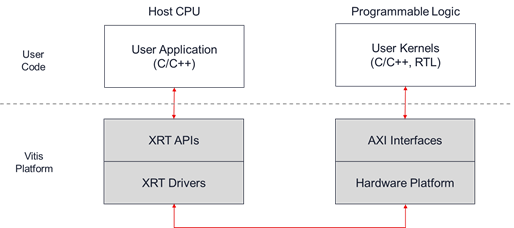
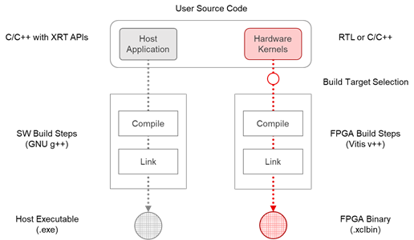
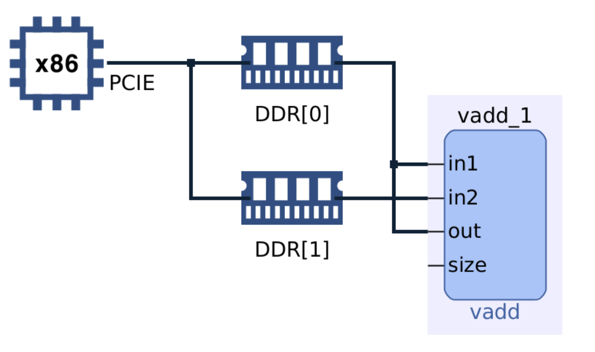
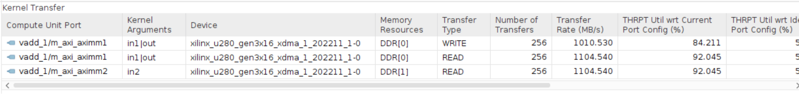

## Introduction
这是一个向量加的简单例子。通过运行这个例子，可以弄清基于 XRT 的加速器设计流程，同时简单了解如何通过 vitis_analyzer 分析性能，从而能够有依据地进行优化。

想用 FPGA 加速一个应用（或者说设计一个加速器），主要包含两部分的设计：在 x86 或 arm 处理器上运行的软件代码和在 FPGA 上运行的 kernel。其中前者也称为 host application，使用 XRT API 与 kernel 进行交互；后者使用 AXI 接口与硬件平台进行交互。可参考如下框图：


host application 和 kernel 的交互流程可以分为以下几个步骤：
1. The host application writes the data needed by a kernel into the global memory of the FPGA device.
2. The host program sets up the input parameters of the kernel.
3. The host program triggers the execution of the kernel.
4. The kernel performs the required computation, accessing global memory to read or write data, as necessary. Kernels can also use streaming connections to communicate with other kernels, passing data from one kernel to the next.
5. The kernel notifies the host that it has completed its task.
6. The host program transfers data from global memory back into host memory, or can give ownership of the data to another kernel.

对于该例子，kernel code 指的是 `./src/vadd.cpp`，host code 指的是 `./src/host.cpp`。

## Build
Build 过程参考下图：


```bash
cd hls_demos/vadd/
mkdir hw_emu
cp ./src/xrt.ini hw_emu/
cd hw_emu
```

Build host application:
```bash
g++ -g -std=c++17 -Wall -O0 ../src/host.cpp -o ./app.exe -I$XILINX_XRT/include/ -L$XILINX_XRT/lib -lxrt_coreutil -pthread
``` 

Compile kernel:
```bash
v++ -c -t hw_emu --platform xilinx_u280_gen3x16_xdma_1_202211_1 --config ../src/u280.cfg -k vadd -I../src ../src/vadd.cpp -o ./vadd.xo
```

执行 `vitis_analyzer --classic vadd.xo.compile_summary` 可以查看 hls 综合报告。

Link kernel：
```bash
v++ -l -t hw_emu --platform xilinx_u280_gen3x16_xdma_1_202211_1 --config ../src/u280.cfg ./vadd.xo -o ./vadd.xclbin
```
链接完成后可以执行以下命令以完成硬件仿真：
```bash
export XCL_EMULATION_MODE=hw_emu
./app.exe
``` 
然后可以执行 `vitis_analyzer --classic`，打开此文件夹，查看 `xrt.run_summary`、`vadd.xo.compile_summary`、`vadd.xclbin.link_summary`。

### xclbin.link_summary
其中 `vadd.xclbin.link_summary` 可以查看 `System Diagram`，如下图所示：

图中展示了 vadd kernel 端口与 memory 的连接关系。

### xrt.run_summary
其中 `xrt.run_summary` 可以查看 `Kernel Data Transfers`，如下图所示：
